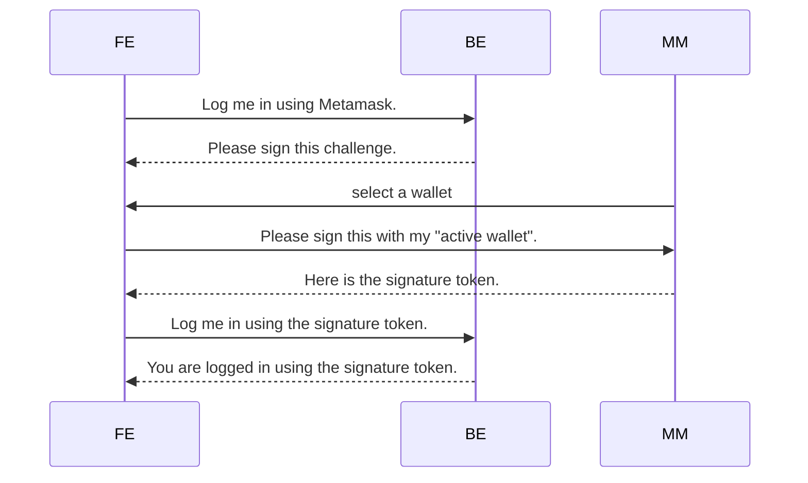

### Web3 authentication

Login sequence

> Note:  no web3 available on mobile, need develop own wallet or use the [app version][mm] of metamask

[mm]: https://consensys.net/blog/news/metamask-mobile-now-available-on-android-and-ios/

![[2022-08-16 09.49 web3-Auth]]